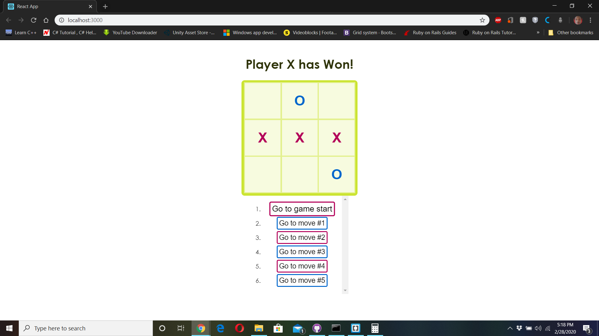

# REACT-TicTacToe
Simple straight forward rendition of the commonly known game Tic Tac Toe, built using React.js

## [Live DEMO Link](https://react-tic-tac-toe-arn.herokuapp.com/)

## Built With

- HTML, CSS
- JavaScript
- Node.js
- React.js

## Authors

👤 **Aaron Rory**

- Github: [@Aaron-RN](https://github.com/Aaron-RN)
- Twitter: [@ARNewbold](https://twitter.com/ARNewbold)
- Linkedin: [Aaron Newbold](https://www.linkedin.com/in/aaron-newbold-1b9233187/)

## 🤝 Contributing

Contributions, issues and feature requests are welcome!

Feel free to check the [issues page](issues/).

## Show your support

Give a ⭐️ if you like this project!

## 📝 License

This project is [MIT](lic.url) licensed.
